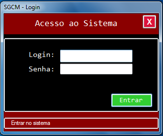
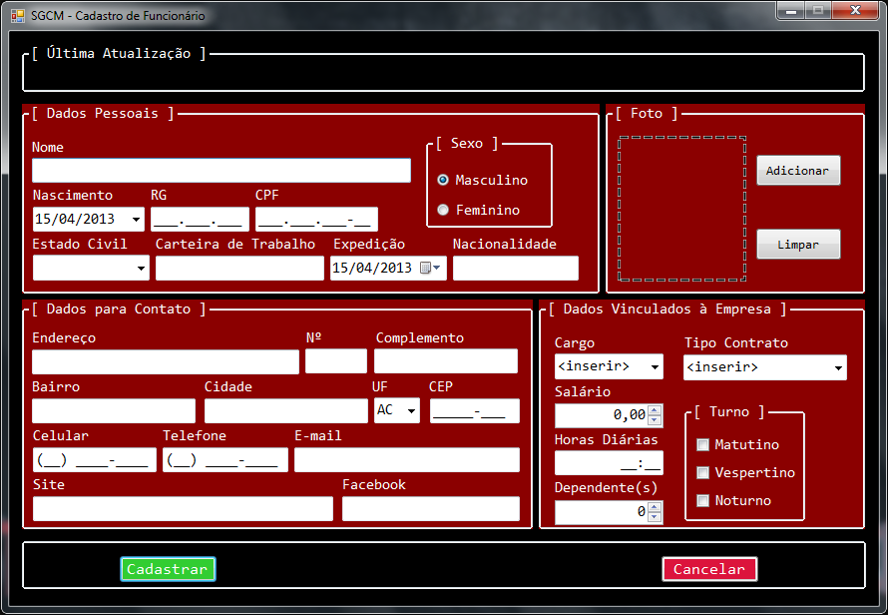
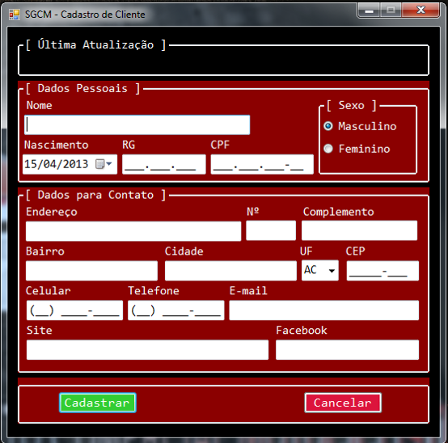
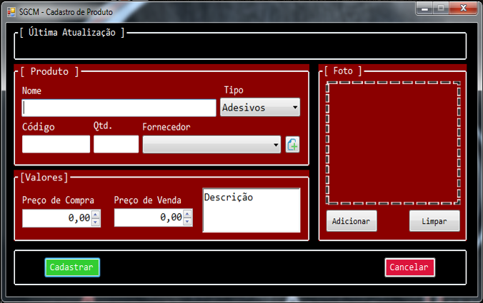
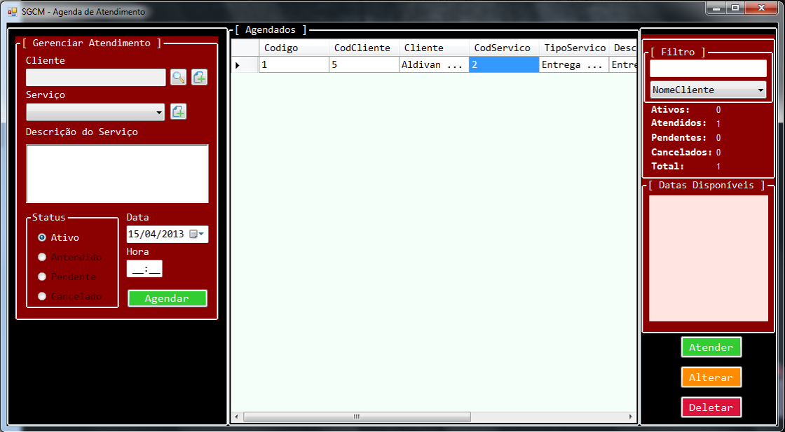
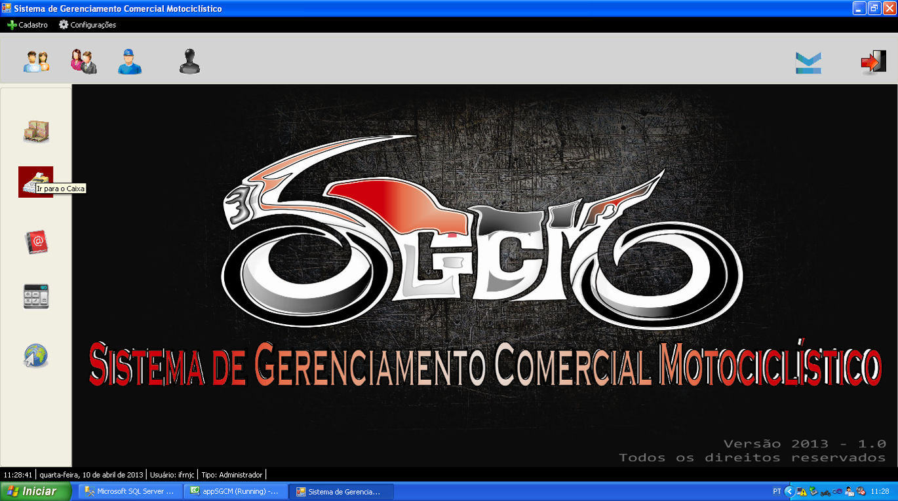
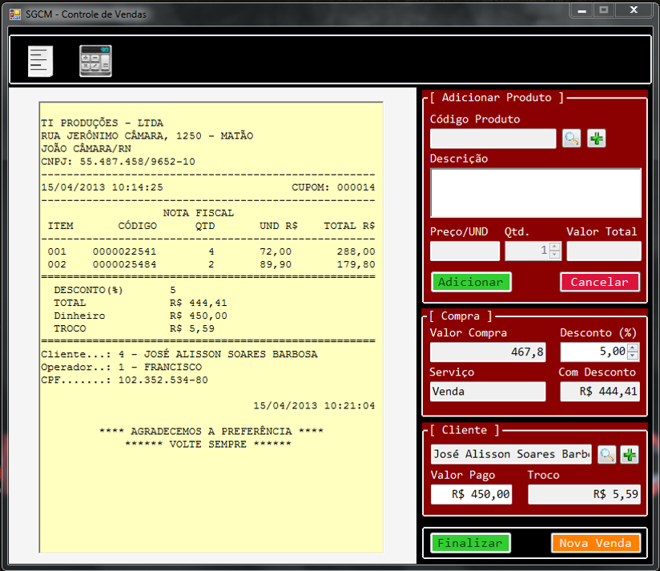

# SGCM
Sistema de Gerenciamento Comercial de Motopeças
  
    Sistema desenvolvido durante o curso de informática no IFRN em 2013
    Parceiro de trabalho: Cleiton Soares (cleiton.soares@outlook.com)
  
O SGCM se propõe a trazer para o mundo virtual aquilo que acontece dentro de uma loja de moto peças. Propomos um sistema que possui a  funcionalidade de gerenciamento de serviços fornecidos pela loja, desde entrega em domicílio, agendamento de serviços com um mecânico em um ambiente de fácil utilidade. 

# Requisitos Funcionais
  - Autenticação;
  - Cadastro e gerenciamento de funcionários, fornecedores, clientes, dados da loja, usuários e produtos;
  - Cadastramento de serviços;
  - Gerenciamento das reservas dos serviços;
  - Controle de vendas e estoque.

# Requisitos não-Funcionais
  - Segurança – Apenas usuários cadastrados podem entrar no sistema;
  - Interface – O sistema apresenta uma interface intuitiva, dinâmica e motivadora;
  - S.O do servidor – Windows XP, Vista, 7 e 8;
  - Linguagens de programação – SQL e C#;
  - Ambiente Operacional – Desktop;
  - Base de Dados – Microsoft SQL Server 2008 R2 (Obrigatório).

# Extra

  - Calculadora básica
  
# Imagens

  
  
  
  
  
  
  
  
